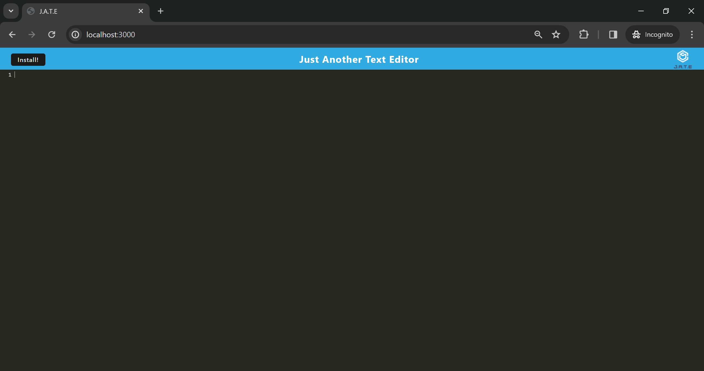

# PWA-Text-Editor-Mutasim

## Description

My task was to build a text editor that runs in the browser. The app
is a single-page application that meets the PWA criteria. Additionally, it features a number of data persistence techniques that serve as redundancy in case one of the options is not supported by the browser. The application will also function offline.

## Technologies Used

Webpack+Workbox, Concurrently, JavaScript, IndexedDB,Express, NodeJS, Babel

## Screen Shots

## Installation & Usage

TO run the app locally in the root directory use the commands

**npm i**

**npm run build**

**npm run start:dev** or **npm run start**

## Deployed link

https://pwa-text-editor-mutasim.onrender.com